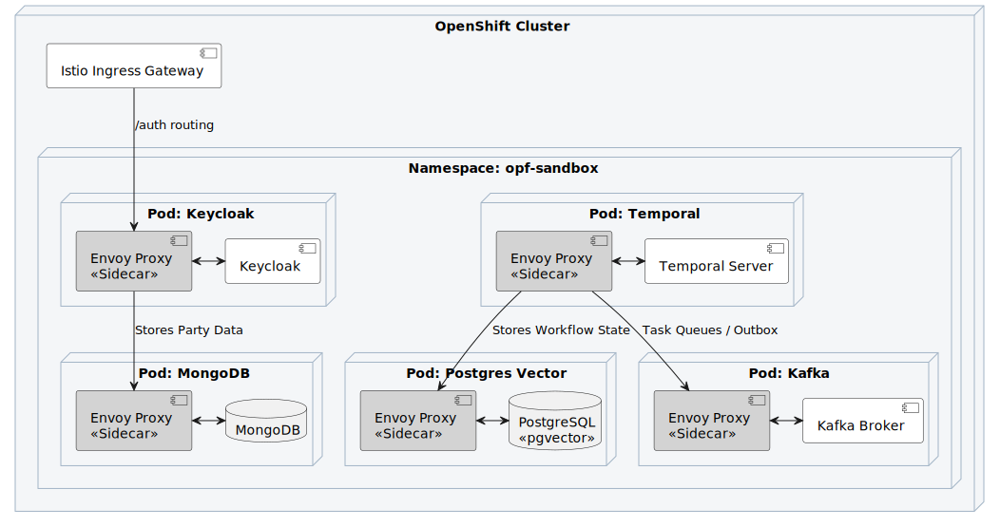

# OPF-Agentive-Platform: The Master Codex

Welcome to the **Agentive Open Finance (BAAS)** platform repository. This document serves as the definitive end-to-end walkthrough for the platform's architecture, implementation, and enterprise governance.

---

## Chapter 1: Executive Summary & The End-to-End Solution
The financial sector is bounded by legacy mainframe limitations. This platform acts as an **Agentive Translation Layer**, sitting between the rigid legacy Finacle/FinOne mainframes and the modern **UAECB OpenFinance** specifications. 

Rather than relying on static APIs and brittle state machines, this platform utilizes **Autonomous AI Agents** orchestrated via Temporal to deterministically analyze, route, and execute Open Finance intents, all while maintaining absolute Data Sovereignty.

---

## Chapter 2: The Agent-Native Architecture
Traditional stateless microservices are insufficient for long-running AI workflows. We operate on the **5 Pillars of AI-Native Design**:
1. **Model Cascades (Mixture of Experts)**: Smart routing layers direct simple requests to ultra-fast SLMs before waking up expensive, foundational LLMs (e.g., Llama-3-70B).
2. **Semantic Caching (`pgvector`)**: Stores vector embeddings of intents, enabling the system to bypass LLM inference entirely for >80% of common Open Finance queries.
3. **Graceful Cognitive Degradation**: Circuit breakers gracefully fall back to local, deterministic Java rules if inference fails.
4. **Memory Banks**: Stateful PostgreSQL "Silver Copies" act as an asynchronous buffer against the fragile legacy mainframe.
5. **The Deterministic Kill Switch**: Hardwired into the Istio Service Mesh. If an anomaly is detected, the agent's SPIFFE ID is revoked and the Temporal pod is instantly scaled to zero.

---

## Chapter 3: The Tripartite AI Anatomy
Our AI stack utilizes the "Sandwich Pattern", physically separating stochastic reasoning from deterministic execution.
- **The Model Layer (The Meat)**: Foundational LLMs served via vLLM inference and `pgvector` caching, hosted internally to ensure 0% PII leakage to public clouds.
- **The Cognitive Layer (The Brain)**: Replaces LangChain with **Temporal SDK** Multi-Agent Workflows, ensuring reasoning steps are durable and auditable.
- **The Harness Layer (The Guardrails)**: Mandatory Java interfaces (like `Agent3Scoper`) that SHA-256 hash all Account Numbers and EIDs before they touch the prompt context. It also includes a **Security LLM (Streaming DLP)** to block Prompt Injections.

---

## Chapter 4: Implementation Tiers (The Codebase)
The repository is structured into distinct Maven modules, compiling down to a resilient Spring Boot 3.x backend:
* **`api-gateway/`**: Spring Cloud Gateway enforcing DPoP and JWT auth.
* **`cognitive-layer/`**: Houses the Temporal `OpenFinanceWorkflow` and `OpenFinanceController` REST entry points.
* **`mediator-layer/`**: The `AgentWorkflowOrchestrator` implements CQRS and Event Sourcing via Kafka Outbox patterns.
* **`identity-access/`**: The Party Data Service (MongoDB) and Keycloak integration handling Strong Customer Authentication (SCA).
* **`anti-corruption-layer/`**: The `FinacleAdapter` translating modern JSON intents into legacy SOAP XML.
* **`frontend-x-bank-souq/`**: The React/Vite Developer Portal.

---

## Chapter 5: OpenShift Sandbox & Deployment
To simulate the production environment locally without requiring AWS EKS, we utilize a full containerized Service Mesh.

**To boot the environment:**
1. `cd infrastructure/sandbox/`
2. `./start-sandbox.sh`
> *Note: This executes `oc apply` to deploy Keycloak, Temporal, Kafka, Redis, and a PostgreSQL `pgvector` database pre-seeded with dummy Open Finance semantic vectors, all wrapped in Istio Envoy sidecars.*

## Chapter 6: TPP Admission & Developer Portal
The Nebras platform requires rigorous background checks for Third Party Providers. This is managed by the React-based Developer Portal (`frontend-x-bank-souq`).

## Chapter 7: The AI Agent Interface (MCP Server)
The platform natively exposes its Agentive workflows to external AI Agents (like Claude Desktop) via the **Model Context Protocol (MCP)**. This allows external LLMs to execute Salary Batches or Car Lease payments as simple "AI Tools".

## Chapter 8: Strategic Analysis & AI Productivity
### Strategic SWOT Analysis
* **Strengths**: Absolute data sovereignty (local LLMs), high resilience (Temporal), and zero-trust security (Istio).
* **Weaknesses**: High initial CapEx for GPU infrastructure and HBM bandwidth requirements.
* **Opportunities**: Radical expansion of Open Banking capabilities without touching legacy Finacle code.
* **Threats**: "Configuration Drift" caused by autonomous scaling, and potential Prompt Injection bypasses.

### AI Productivity Tracking (DORA)
We utilize background telemetry (`Agent5Dora`) to track the exact ratio of Human-vs-AI code generation inline within the IDE, protecting senior engineers from review bottlenecks. See [AI Productivity Tracking](docs/ai_productivity_tracking_v1.md).

---

## Chapter 9: The Master Documentation Codex
For an exhaustive dive into specific architectural constraints, refer to the following `_v1` baseline documents:

| Document | Description | Link |
| :--- | :--- | :--- |
| **System Architecture** | Overarching Component Layout | [Link](docs/system_architecture_v1.md) |
| **Technology Architecture** | Concrete Stack & Infra Choices | [Link](docs/technology_architecture_v1.md) |
| **Data Architecture** | CQRS, Vector Cache, and Memory Banks | [Link](docs/data_architecture_v1.md) |
| **High-Level Design (HLD)** | Top-level system flows | [Link](docs/hld_document_v1.md) |
| **Low-Level Design (LLD)** | Component interactions & class structures | [Link](docs/lld_document_v1.md) |
| **API & AI Anatomy** | Endpoints, Webhooks & The Sandwich Pattern | [Link](docs/api_and_ai_anatomy_v1.md) |
| **Business Context** | UAECB Regulations & Alignments | [Link](docs/business_context_and_regulations_v1.md) |
| **Deployment Plan** | OpenShift / Terraform execution strategy | [Link](docs/deployment_plan_v1.md) |
| **Architecture Review Board**| ARB Decisions & Derogations | [Link](docs/arb_document_v1.md) |
| **Change Advisory Board** | CAB Deployment Risks | [Link](docs/cab_document_v1.md) |
