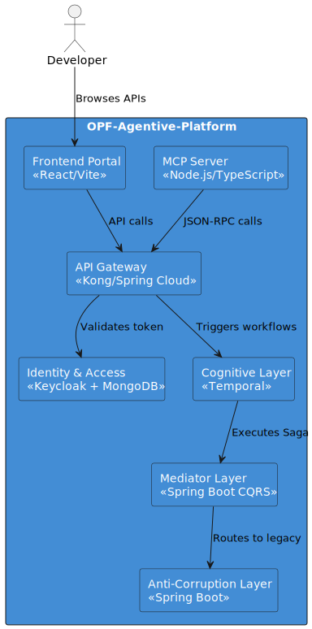

# Architecture Review Board (ARB) Submission
**Project:** OPF-Agentive-Platform

## 1. Problem Statement
Legacy banking interfaces are too tightly coupled to satisfy immediate OpenFinance capabilities required by UAE Central Bank regulations.

## 2. Proposed Architecture

## 3. Trade-offs & Tech Debts
- **Tech Debt:** Maintaining duplicate data in the Silver Copy DB.
- **Mitigation:** Strict CDC (Change Data Capture) polling via Kafka.
- **Trade-off:** High operational complexity using Temporal and Kafka together, offset by extreme reliability during system failures.
- **ARB Decision 001 - Autonomous Ingestion:** Approved the use of `AgentIngestionKafkaListener` to autonomously trap webhooks, acknowledging the risk of LLM loop triggers. Mitigated via strict `FteCostOptimizer` budgets.
- **ARB Decision 002 - Real-Time Streaming:** Approved the derogation of standard REST patterns in favor of Spring WebSockets (Java Virtual Threads) + Next.js to support streaming LLM chat.
- **ARB Decision 003 - IAM Decoupling:** Mandated 12-Factor `WebClient` usage for external Git/Jira traffic to prevent credentials from ever leaking into Temporal workflow states.

## 4. Compliance & Security Gates
- All requests mandate DPoP bound OAuth2 tokens.
- PII is automatically hashed via Keycloak/MongoDB schemas.
- pgvector ensures agentic RAG outputs comply with PCI-DSS.
