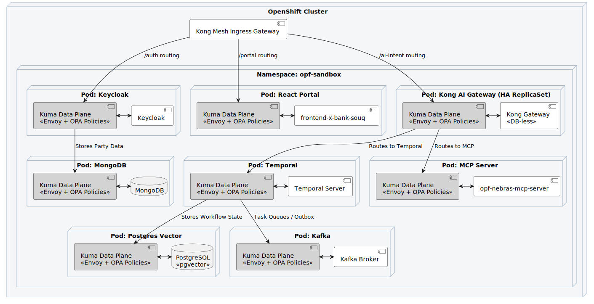

# Deployment Plan
**Project:** OPF-Agentive-Platform

## 1. GitOps Strategy
We use ArgoCD for continuous delivery to AWS EKS clusters.
- **Environments:** DEV -> UAT -> PRE-PROD -> PROD.

## 2. Phased Rollout (Strangler Fig)
- **Phase 1:** Deploy the Cognitive Layer and Identity Access purely in "Shadow Mode" (reading traffic but not mutating).
- **Phase 2:** Reroute 10% of API portal traffic to the Mediator.
- **Phase 3:** Full cutover for Open Finance APIs. Legacy monolith read endpoints are deprecated.

## 3. Infrastructure as Code & Components
All AWS ROSA (Red Hat OpenShift on AWS) configurations, MSK (Kafka) clusters, and MongoDB/PostgreSQL instances are provisioned via Terraform modules checked into the `infrastructure/` monorepo.
- **Next.js Portals**: The dual Next.js frontends (`Developer Portal` and `HITL Dashboard`) are deployed via dedicated Vercel pipelines or containerized inside OpenShift, depending on regulatory data sovereignty requirements.
- **MSK Kafka Broker**: A dedicated topic `cbuae.openfinance.events` is pre-provisioned via IaC for the autonomous webhook ingestion feature.

## 4. Local Sandbox Environment (OpenShift/Istio)
For local development, we maintain a complete OpenShift Sandbox ecosystem via CodeReady Containers (CRC) or a local K3s instance mapped to Istio. This ensures that the Zero-Trust mesh policies developed locally behave identically in AWS EKS.

**To spin up the sandbox:**
1. Navigate to `infrastructure/sandbox/`
2. Ensure you are authenticated with your cluster (`oc login`).
3. Execute `./start-sandbox.sh`
4. This script applies all Istio Gateway, VirtualService, and Deployment manifests to the `opf-sandbox` namespace. It automatically injects the Envoy sidecars, boots Temporal, Keycloak, Kafka, Redis, and a `pgvector` Postgres instance pre-seeded with dummy Open Finance semantic vectors.
