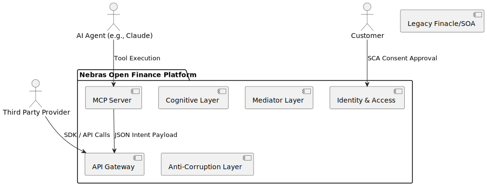

# High-Level Design (HLD)
**Project:** OPF-Agentive-Platform

## 1. Executive Summary
The OPF-Agentive-Platform translates legacy core banking requests into unified Open Finance CBUAE standards.

## 2. Architecture Context

## 4. Core Workflows (Agentive Flows)

Instead of hardcoded APIs, core flows are represented by dynamic **Agent Workflows**:
- **MCP Server Flow**: Autonomous LLMs interact with the platform natively through the MCP server, discovering tools (`nebras_initiate_consent`, `nebras_execute_salary_batch`) and executing banking intents via JSON-RPC.
- **TPP Admission**: Autonomous review of third-party onboarding documents, utilizing the Security LLM for DLP and a Human-in-the-Loop circuit breaker for high-risk applications before automatically provisioning Keycloak credentials.
- **Account Retrieval (`GET /accounts`)**: The cognitive layer bypasses the mainframe if a fresh vector matches in the `pgvector` cache, else it queries the "Memory Bank" silver copy.
- **Payment Initiation (`POST /domestic-payments`)**: Requires Deep Reasoning LLM. Validates DPoP, hashes PII, and executes a Transactional Outbox pattern into Kafka.
- **Consent Generation (SCA)**: Leverages Temporal's long-running state to wait for user 2FA approval on their mobile device without holding an active HTTP thread.
- **Autonomous Event Ingestion**: `AgentIngestionKafkaListener` continuously polls OpenFinance webhooks and delegates them strictly to the `AUTONOMOUS_INGESTION` Agent-FTE role, completely bypassing synchronous REST flows.

## 3. High-Level Components
- **AI Gateway & API Gateway (Spring Cloud Gateway):** Secures all incoming developer traffic, enforces Token Validation (Auth/Authz) for Agents, asserts Consent Management bounds, and maintains streaming chat connections.
- **Cognitive Layer (Temporal):** Orchestrates AI intent mapping.
- **Mediator (CQRS/Saga):** Enforces distributed transaction state.
- **Legacy Systems:** Finacle & FinOne core integration via ACL.

## 4. Key Architectural Decisions
- Use of localized LLMs to maintain Data Sovereignty.
- Bounded context design avoiding "Big Bang" monolith refactoring.
