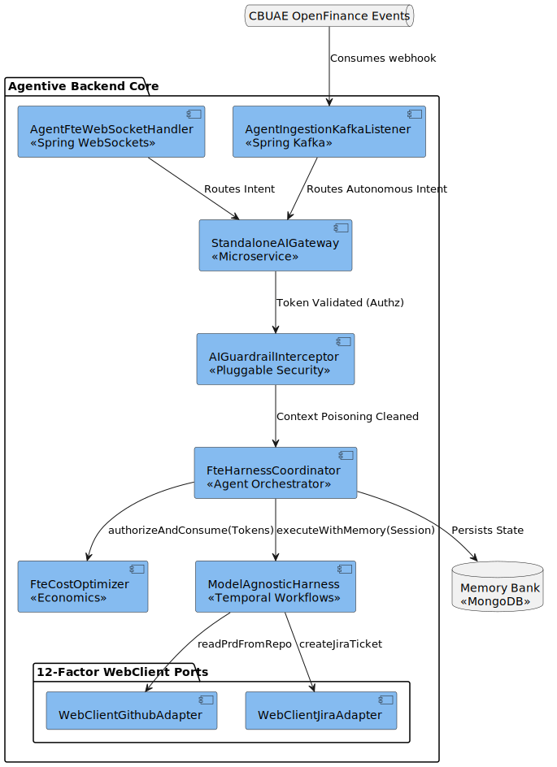
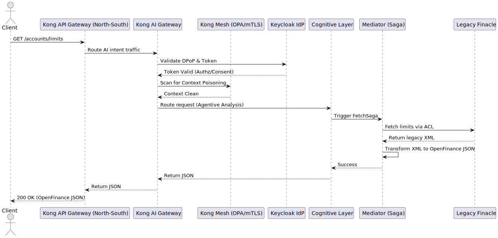
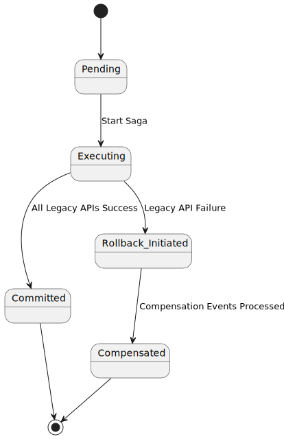

# Low-Level Design (LLD)
**Project:** OPF-Agentive-Platform

## 1. Component Interactions

> **Deep Dive:** For an exhaustive breakdown of the specific Open Finance API Endpoints, Webhook configurations, and the Tripartite AI Architecture (Harness + Cognitive + Model) powering these interactions, please refer to the [API Definitions & AI Anatomy](api_and_ai_anatomy_v2.md) documentation.

## 2. Low-Level Agentive Flow (Harness & Economics)
The following describes the exact routing paths for the AI components:
- **`FteHarnessCoordinator`**: Acts as the central traffic controller. Receives prompts via `AgentFteWebSocketHandler` or `AgentIngestionKafkaListener`.
- **`FteCostOptimizer`**: Before execution, the Coordinator delegates to the Optimizer to assert budget constraints using `AgentFteData`.
- **`ModelAgnosticHarness`**: The Temporal workflow executing the prompt. It retrieves the conversation context from `SessionMemory` inside MongoDB.
- **`12-Factor WebClient Ports`**: The Harness translates intent into programmatic actions via strictly decoupled Hexagonal outbound ports (`WebClientGithubAdapter`, `WebClientJiraAdapter`), loaded via Spring `@Value` configs.

## 3. State Management & Saga
To prevent data inconsistency when legacy APIs fail, a Compensating Transaction model is used.

## 4. Database Schema (Silver Copy)
- `party_data`: Stores SCA profiles securely on MongoDB.
- `transaction_outbox`: Stores un-synced events locally in Postgres before Kafka publishing.
