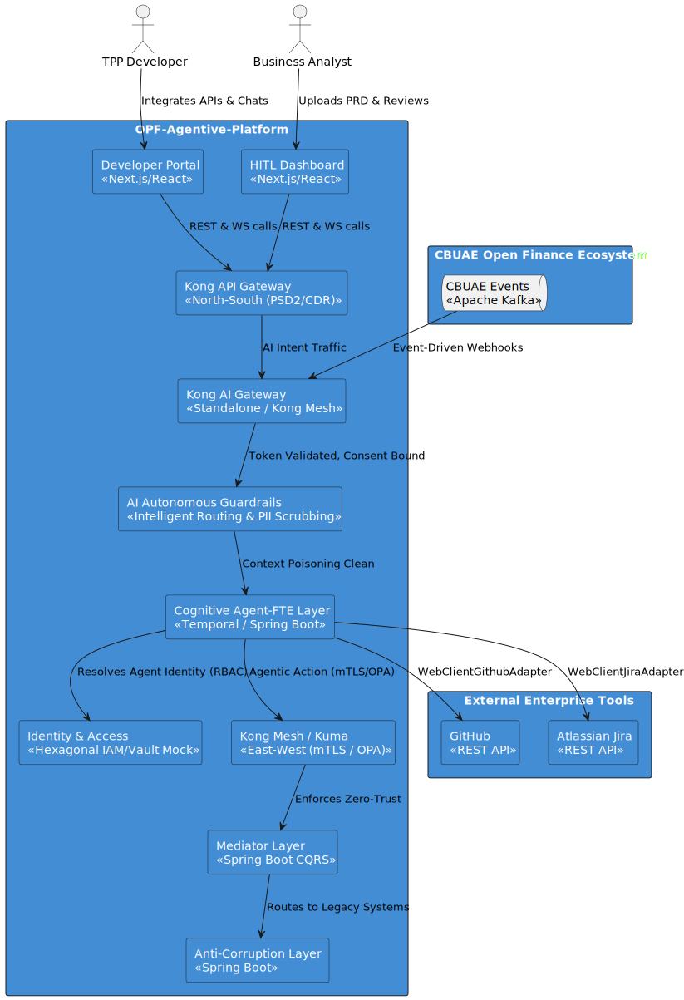
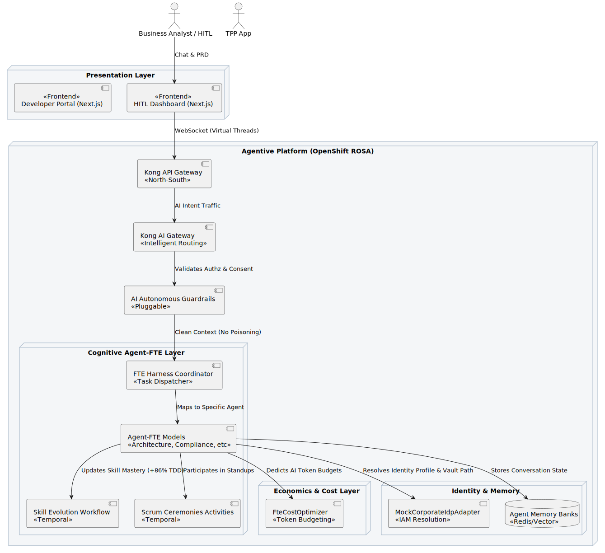
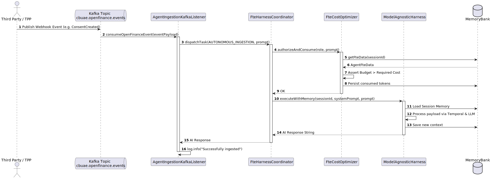

# OPF-Agentive-Platform System Architecture

This document outlines the core architectural components of the Agentive-OpenFinance-BAAS platform. The goal is to convert legacy Banking as a Service (BaaS) interfaces into UAECB OpenFinance-compliant endpoints via an Agentive Interface.

## System Architecture Overview

## Frontend & Presentation Layer
- **Developer Portal (Next.js)**: Replaces generic portals with a tailored, modern TPP integration platform.
- **Internal HITL Dashboard (Next.js)**: Serves internal Business Analysts to upload PRDs, interact directly with Agent-FTEs via WebSocket chat, and approve operations.

## Security & Access Management
- **Kong API Gateway (North-South)**: Banks extensively use Kong to manage Open Banking compliance (PSD2, CDR), handling strict mTLS, OAuth2/OIDC, and Consent Orchestration when dealing with external Third-Party Providers.
- **Kong Mesh / Kuma (East-West)**: Used internally to enforce Zero-Trust architectures. By enforcing mTLS between every single microservice pod and applying centralized OPA (Open Policy Agent) rules, they prevent lateral movement during breaches.
- **Kong AI Gateway**: Early adopters are utilizing it for Autonomous Guardrails (Prompt Injection protection, PII scrubbing) and Intelligent Routing (dynamically switching between OpenAI, Anthropic, or internal Llama models to manage costs and data privacy). This stateless gateway is integrated directly into the Kong Mesh.
- **Agent Identity Management (IAM)**: A strict **Hexagonal Architecture** separates Agent credentials. `AgentIdentityProviderPort` dynamically fetches Agent Identity Profiles (including decoupled GitHub/Jira credentials from HashVault Manager) for precise **Role-Based Access Control (RBAC)** across specialized AI workloads.
- **AI Security (Context Protection)**: Incoming payloads are scanned by a brand-agnostic, pluggable **AI Guardrail** layer (adaptable to internal Security LLMs, Nvidia NeMo, or Lakera) to prevent **Context Poisoning** and prompt injection. This ensures malicious RAG payloads cannot manipulate Agent intents.

## AI & Cognitive Agent-FTE Layer

- **Agent-FTE Models**: Specialized LLM orchestrators functioning as autonomous employees (e.g., `AUTONOMOUS_INGESTION`, `TOPOLOGY_SYNTHESIS`, `COMPLIANCE_VALIDATION`).
- **Scrum Ceremonies Automation**: Governed by Temporal workflows (`ScrumCeremoniesActivitiesImpl`), these agents execute daily standups, review PRDs, and update agile boards.
- **Skill Evolution**: The `SkillEvolutionWorkflow` tracks Agent task completions, automatically boosting their capability scores recursively (+86% TDD enforcement).
- **Agent Economics**: An `FteCostOptimizer` evaluates token costs and orchestrates real-time AI usage budgets to prevent runaway cloud expenses.

## Orchestration & Event-Driven Event Ingestion Layers
- **Autonomous Kafka Ingestion**: OpenFinance webhooks pushed to the `cbuae.openfinance.events` topic are automatically trapped by `AgentIngestionKafkaListener` and dispatched directly to the `AUTONOMOUS_INGESTION` Agent without human oversight.

- **Mediator Layer (CQRS/Event Sourcing)**: Uses an Outbox pattern with Apache Kafka to guarantee transaction delivery. It separates the "intent to pay" (Cognitive) from the "execution of payment" (Legacy).
- **Storage Strategy**: Golden CDC source replicated to a Silver Copy to support CQRS for Read Services.

## Integration & Legacy Layers
- **Anti-Corruption Layer (ACL)**: Spring Boot + MuleSoft wrapping legacy endpoints.
- **BackEnd Systems**: 
  - FinOne (Customer API)
  - Finacle (Core Banking API - Legacy)
