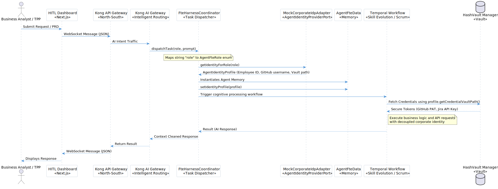

# Technology Architecture
**Project:** OPF-Agentive-Platform
**Version:** v1

This document outlines the concrete technology stack powering the Agentive Open Finance Platform, designed for extreme scalability, data sovereignty, and zero-trust security.

## 1. Deployment Platform & Infrastructure (ROSA IaC)
- **Orchestration**: Red Hat OpenShift on AWS (ROSA). We use explicit Terraform (`main.tf`) Node Pools:
  - **Core Microservices**: `m6g.xlarge` instances dedicated solely to the synchronous, Hexagonal transactional APIs.
  - **Agentive Spot Pool**: `r6g.2xlarge` Spot Instances to optimize heavy memory workloads (embedding generation, cognitive processing) without starving the core transactional APIs.
- **Service Mesh**: Istio. All pods are injected with Envoy proxy sidecars for mTLS.
- **Strict Sandboxing**: Autonomous agents executing code are isolated in strict sandboxed environments (**WASM** or **gVisor**) to mitigate cyber risks.

## 2. Application Layer (Frontend & Backend)
- **Dual Next.js Frontends**: The `Developer Portal` and `Internal HITL Dashboard` use Next.js with React 19, Tailwind CSS, and a Cyber-Corporate dark mode aesthetic (`presentation-layer`).
- **Gateway & WebSockets**: Spring Cloud Gateway and custom Spring Boot Handlers (`AgentFteWebSocketHandler`) using **Java 21 Virtual Threads** enabling highly concurrent reactive chat streaming.
- **Microservices Core**: Java 21, Spring Boot 3.x, heavily emphasizing TDD >86%.
- **Identity Provider (IAM)**: Strict **Hexagonal Architecture** manages Agent Identities via `AgentIdentityProviderPort` and `MockCorporateIdpAdapter`. AWS Secrets Manager/Vault handles decoupled access tokens.

## 3. Cognitive Agent-FTE Workflow Engine
- **Framework**: Model Context Protocol (MCP) SDK, LangChain4j, Temporal SDK.
- **Agent Workflows**: Built on Temporal to handle durable execution. `SkillEvolutionWorkflow` orchestrates continuous learning loops, boosting agent mastery dynamically, while `ScrumCeremoniesActivitiesImpl` automates agile routines.
- **WebSocket Streaming**: Streaming responses push directly from Temporal workers through Virtual Threads to the frontend without blocking the HTTP thread pool.

## 4. 12-Factor API Integrations & Economics
- **12-Factor WebClient Adapters**: Outbound connections (like `WebClientGithubAdapter` and `WebClientJiraAdapter`) strictly adhere to the 12-Factor Config principle. Configurations and API endpoints are dynamically loaded via `@Value` annotations from environment properties.
- **Agent Economics**: Token costs are managed by `FteCostOptimizer`. When an AI task is dispatched, the system proactively authorizes and consumes tokens. If an `InsufficientFteBudgetException` occurs, it is trapped and routed back to the HITL dashboard to prevent unhandled API explosions.

## 5. Mediator & Async Streaming
- **Event Broker**: Confluent Kafka. Serves as the central nervous system for OpenFinance webhooks. The `AgentIngestionKafkaListener` subscribes to the `cbuae.openfinance.events` topic and directly triggers the autonomous Agent-FTEs.

## 6. Security Architecture

- **Identity Decoupling**: Each Agent FTE operates with a distinct `AgentIdentityProfile`. Credentials for GitHub/Jira are not held in memory but fetched from an external Vault just-in-time via an outbound port.
